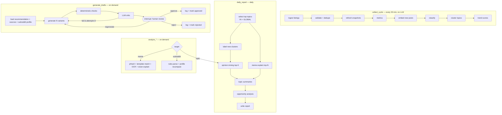
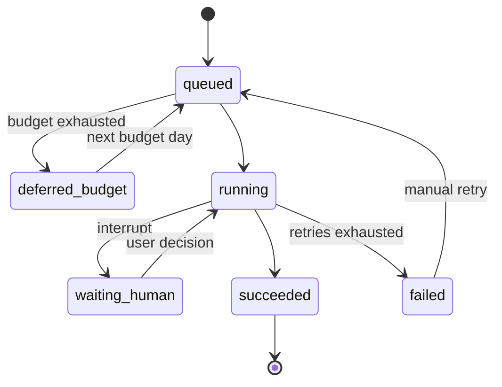

# AI Agent Design

## Core idea

The master prompt's 12-step pipeline is the **logical** flow. It is **not** built as one giant graph. Instead there are **small LangGraph graphs per job**, which share node functions (ADR-004). This gives selective execution for free: a meme request runs the meme graph, not the other eleven agents.

Most "agents" are plain deterministic Python. Only these nodes call an LLM:

| Node | LLM? | Model tier | Why |
|---|---|---|---|
| Research (ingest) | ❌ | — | API calls |
| Data validation | ❌ | — | schema + dedupe |
| Trend detection | ❌ | — | maths |
| Domain classification | ⚠️ fallback only | cheap | keywords + embeddings first; LLM for low-confidence, high-engagement posts |
| Topic labelling | ✅ batched | cheap | name clusters in ≤ 6 words, once per new cluster |
| Opinion mining | ✅ | cheap→strong | needs language understanding |
| Meme intelligence | ✅ top-N only | vision | joke/reference explanation |
| Subreddit intelligence | ⚠️ rule parsing only | cheap | once per rules change |
| Opportunity analysis | ⚠️ ranking is deterministic; rationale text via LLM | cheap | |
| Content generation | ✅ | strong | |
| Quality critic | ✅ + deterministic | cheap | |
| Human approval | ❌ | — | interrupt |
| Performance feedback | ❌ | — | maths |

## Graphs



The full logical chain (research → … → performance feedback) is achieved by chaining jobs: `collect_cycle` → `daily_report` → user picks an opportunity → `generate_drafts` → approval → `track_contributions` → feedback updates opportunity weights (L).

## State

Each graph has a typed state (`TypedDict` / Pydantic). It carries IDs, not blobs; nodes load what they need from the DB. This keeps checkpoints small.

```python
class DraftState(TypedDict):
    run_id: UUID
    recommendation_id: UUID
    variants: int
    style: Style
    draft_ids: list[UUID]
    critic_attempts: int
    human_decision: Literal["approve", "reject", "regenerate"] | None
    errors: list[NodeError]
```

Run status machine (stored in `agent_runs.status`):



## LLM client (thin abstraction)

One module `agents/llm.py`, one function used everywhere:

```python
async def structured(task: Task, schema: type[T], messages: list[Msg], *, images: list[ImageRef] = []) -> T
```

- `Task` maps to a model via settings (`cheap`, `strong`, `vision`). Default provider: Anthropic (Haiku for cheap, Sonnet for strong/vision). This is swappable by config; a second provider adapter gets added only when actually needed (ADR-009).
- Structured outputs: Pydantic schema → provider tool/JSON-schema mode → validated. On a validation failure there is 1 repair retry with the error message, then the call fails.
- Every call records `tokens_in/out`, `cost_usd` (price table in config) and `duration_ms` into `agent_run_steps`.
- **Budget gate:** before each call, estimate the cost; if today's spend + estimate > `LLM_DAILY_BUDGET_USD`, raise `BudgetExceeded`. The run goes to `deferred_budget` (scheduled jobs) or returns a clear error to the UI (on-demand jobs).
- Timeouts: 60 s per call (configurable). Retries: 3 with exponential backoff + jitter on 429/5xx/timeouts only.
- Test double: `FakeLLM` returns fixture outputs per schema, so tests never hit the network.

## Prompt-injection posture

Reddit content is untrusted. It is always passed inside clearly delimited data blocks, the system prompt states that content inside them is data and never instructions, outputs are schema-constrained, and no tool use is given to models that read Reddit content. A post saying "ignore previous instructions" can at worst produce a bad summary, never an action.

## Cost controls

| Control | Default |
|---|---|
| Daily LLM budget | $1.00 |
| Opinion mining per daily report | top 10 topics, ≤ 40 sampled comments each |
| Vision meme explanations per day | 20 |
| Classification LLM fallback per day | 200 posts, batched 20/call |
| Cluster labelling | only new/changed clusters, batched |
| Caching | embeddings stored on rows; LLM outputs keyed by `(task, input_hash, model)` in Redis for 24 h |
| Draft generation | on demand only; all N variants in **one** call |

## Observability

`agent_runs` + `agent_run_steps` feed the Agent Execution Monitor: per-run timeline, per-node status/attempts/duration, tokens, cost, errors, plus a "today's spend vs budget" gauge. LangSmith is optional (off by default) and not required.

## Evaluation

Small hand-labelled golden sets in `backend/tests/evals/` (no Reddit text committed; synthetic or paraphrased examples only):
- classification: 100 posts → expected labels (precision/recall per category)
- critic: 30 drafts with known violations → must flag ≥ 90%
- opinion mining: 10 threads → evidence IDs must exist in the input (100%), no fabricated quotes
Evals run via `pytest -m eval` manually or nightly, not on every PR (they cost tokens).
