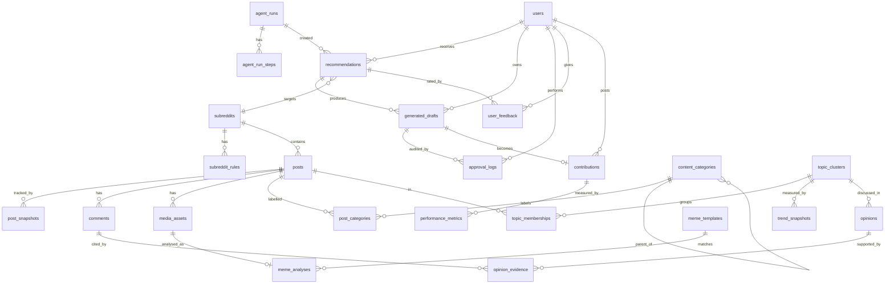

# Database Design

PostgreSQL 16 + `pgvector`. Migrations use **Alembic** (autogenerate, then hand-review). All primary keys are `uuid` (`gen_random_uuid()`) except where a natural Reddit key is the real identity (it is still stored as a unique column, never as the PK). Timestamps are `timestamptz`, stored in UTC.

Embedding dimension: **384** (local model, see ADR-003). If the model changes, add a new column + migration and re-embed; never mix dimensions.

## ER diagram

## Tables

### Identity
**users** — `id`, `email` (unique), `display_name`, `password_hash`, `reddit_username` (nullable), `reddit_refresh_token_enc` (bytea, encrypted, L), `settings` jsonb, `created_at`.
Single user in MVP; the table exists so ownership columns are correct from day 1.

### Reddit content
**subreddits** — `id`, `name` (citext, unique), `region` (`IN`|`GLOBAL`), `tags` text[], `enabled` bool, `poll_interval_min` int, `description`, `subscribers` int, `over18` bool, `post_requirements` jsonb, `profile` jsonb (computed observed characteristics + baselines), `profile_updated_at`, `last_collected_at`, `source`.
Index: `(enabled)`, `(region)`.

**subreddit_rules** — `id`, `subreddit_id` FK, `priority` int, `short_name`, `description`, `kind` (`link`|`comment`|`all`), `constraints` jsonb (machine-checkable rules parsed from text), `fetched_at`. Unique `(subreddit_id, priority)`.

**posts** — `id`, `reddit_id` (e.g. `t3_abc123`, unique), `subreddit_id` FK, `title`, `body`, `url`, `permalink`, `author_hash` (salted SHA-256), `created_utc`, `content_type` (enum: `text`,`question`,`link`,`image`,`gif`,`video`,`gallery`,`poll`,`news`,`other`), `flair`, `over18`, `is_deleted` bool, `score`, `num_comments`, `upvote_ratio` (latest values, denormalised from snapshots), `embedding` vector(384), `embedded_at`, `region`, `first_seen_at`, `last_polled_at`, `source`, `raw` jsonb (trimmed API payload, purged with text).
Indexes: `(subreddit_id, created_utc desc)`, `(created_utc desc)`, `(content_type)`, `(region, created_utc desc)`, HNSW on `embedding vector_cosine_ops`, GIN `to_tsvector('english', title || ' ' || coalesce(body,''))`.

**post_snapshots** — `id` bigserial, `post_id` FK, `captured_at`, `score`, `num_comments`, `upvote_ratio`. Index `(post_id, captured_at)`. *Not in the original entity list; it is needed because velocity requires repeated observations.* Pruned to hourly granularity after 48 h and dropped after 14 days.

**comments** — `id`, `reddit_id` unique, `post_id` FK, `parent_reddit_id`, `author_hash`, `body`, `score`, `depth`, `created_utc`, `is_deleted`, `embedding` vector(384) nullable (only for comments used in opinion mining), `source`. Index `(post_id, score desc)`.

**media_assets** — `id`, `post_id` FK, `kind` (`image`|`gif`|`video`|`gallery_item`), `reddit_media_url`, `preview_url`, `width`, `height`, `duration_s`, `phash` bigint (64-bit perceptual hash), `ocr_text`, `ocr_at`, `processed_at`. **No binary media is stored** (ADR-006). Index `(phash)`; Hamming distance uses `bit_count(phash # :q)`.

### Classification & topics
**content_categories** — `id`, `parent_id` FK self, `level` (`category`|`subcategory`|`topic`), `slug` unique, `name`, `keywords` text[], `centroid` vector(384), `taxonomy_version`, `active`. This is the "topics" taxonomy from the spec: taxonomy topics are the leaf level here.

**post_categories** — `post_id`, `category_id`, `confidence` real, `method` (`keyword`|`embedding`|`llm`), PK `(post_id, category_id)`. Index `(category_id, confidence desc)`.

**topic_clusters** — `id`, `label` (short human label, LLM-named lazily), `summary`, `centroid` vector(384), `region_mix` jsonb, `subreddit_ids` uuid[], `first_seen_at`, `last_seen_at`, `status` (`emerging`|`rising`|`peaking`|`declining`|`recurring`|`dormant`), `primary_category_id` FK. HNSW on `centroid`.

**topic_memberships** — `topic_id`, `post_id`, `similarity` real, PK `(topic_id, post_id)`.

**trend_snapshots** — `id` bigserial, `topic_id` FK, `captured_at`, `post_count`, `subreddit_count`, `total_score`, `total_comments`, `velocity`, `comment_velocity`, `relative_engagement`, `novelty`, `discussion_intensity`, `trend_score`, `score_breakdown` jsonb, `scoring_version`. Index `(topic_id, captured_at desc)`, `(captured_at, trend_score desc)`.

### Analysis outputs
**opinions** — `id`, `topic_id` FK nullable, `post_id` FK nullable (one of them is required, CHECK), `kind` (`main`|`minority`|`argument`|`counterargument`|`question`|`experience`), `stance_label`, `summary`, `share_estimate` real, `tone`, `basis` (`observed`|`interpretation`), `agent_run_id`, `created_at`.

**opinion_evidence** — `opinion_id`, `comment_id`, `excerpt` (≤ 280 chars), PK `(opinion_id, comment_id)`.

**meme_templates** — `id`, `name`, `description`, `canonical_phash` bigint, `example_media_id` FK, `first_seen_at`, `last_seen_at`, `post_count`, `subreddit_ids` uuid[], `region_mix` jsonb, `lifecycle_status`.

**meme_analyses** — `id`, `media_asset_id` FK unique, `template_id` FK nullable, `originality` (`original`|`template_reuse`|`remix`|`repost`|`unknown`), `repost_of_post_id` FK nullable, `scene`, `joke`, `cultural_reference`, `audience`, `humour_category`, `region` (`IN`|`GLOBAL`|`both`), `community_specific` bool, `model`, `agent_run_id`, `created_at`.

**daily_reports** — `id`, `report_date` unique, `content` jsonb (structured), `agent_run_id`, `created_at`. *Added: the source for the Daily Trends page.*

### Recommendations & studio
**recommendations** — `id`, `user_id`, `type` (enum, see CONTENT_GENERATION.md), `subreddit_id`, `category_id`, `topic_id`, `title_suggestion`, `angle`, `rationale`, `trend_status`, `audience`, `format`, `risks` text[], `confidence` real, `opportunity_score` real, `score_breakdown` jsonb, `source_post_ids` uuid[], `status` (`new`|`dismissed`|`drafted`), `agent_run_id`, `created_at`, `expires_at`. Index `(status, opportunity_score desc)`.

**generated_drafts** — `id`, `user_id`, `recommendation_id` FK, `parent_draft_id` FK self (regenerations/edits form a version chain), `variant_no`, `format`, `style`, `title`, `body`, `meme_concept` jsonb, `critic_verdict` (`pass`|`warn`|`fail`), `critic_report` jsonb, `status` (`generated`|`in_review`|`approved`|`rejected`|`posted`), `edited_by_user` bool, `model`, `agent_run_id`, `created_at`. Index `(user_id, status, created_at desc)`.

**approval_logs** — `id`, `user_id`, `draft_id` FK, `action` (`approve`|`reject`|`edit`|`copy`|`publish`|`link_post`), `details` jsonb, `created_at`. Append-only (no UPDATE/DELETE grants for the app role, L).

**user_feedback** — `id`, `user_id`, `target_type` (`recommendation`|`draft`|`topic`|`opinion`), `target_id`, `rating` smallint (-1/0/1), `comment`, `created_at`.

**contributions** — `id`, `user_id`, `draft_id` FK nullable, `reddit_id` unique, `subreddit_id`, `permalink`, `posted_at`. *Added: links a user's real Reddit post to the draft it came from.*

**performance_metrics** — `id` bigserial, `contribution_id` FK, `captured_at`, `score`, `num_comments`, `upvote_ratio`, `unique_commenters`, `max_depth`, `op_replies`. Index `(contribution_id, captured_at)`.

### Agent runtime
**agent_runs** — `id`, `graph` (`daily_report`, `generate_drafts`, …), `trigger` (`schedule`|`user`), `status` (`queued`|`running`|`waiting_human`|`succeeded`|`failed`|`deferred_budget`), `input` jsonb, `output_ref` jsonb, `error`, `tokens_in`, `tokens_out`, `cost_usd` numeric(10,5), `started_at`, `finished_at`. Index `(graph, started_at desc)`, `(status)`.

**agent_run_steps** — `id`, `run_id` FK, `node`, `status`, `attempt`, `model`, `tokens_in`, `tokens_out`, `cost_usd`, `duration_ms`, `error`, `started_at`.

LangGraph checkpoints use `langgraph-checkpoint-postgres` in the same DB, in their own tables (managed by that library, not by Alembic).

**config_versions** — `id`, `kind` (`taxonomy`|`scoring`), `version`, `content` jsonb, `active`, `created_at`.

## Daily LLM spend query
`SELECT coalesce(sum(cost_usd),0) FROM agent_run_steps WHERE started_at >= date_trunc('day', now() AT TIME ZONE 'Asia/Kolkata') AT TIME ZONE 'Asia/Kolkata'` gates every LLM call (ADR-011: budget day = IST).

## Retention

| Data | Kept | Mechanism |
|---|---|---|
| `posts.body/raw`, `comments.body` | 30 days (configurable), purged immediately if deleted on Reddit | `retention` job nulls the text, keeps the row + metrics |
| `post_snapshots` | 14 days | delete |
| `media_assets.ocr_text` | with parent post | null |
| aggregates (`trend_snapshots`, `topic_clusters`, `meme_templates`) | indefinitely | no user content |
| `approval_logs` | indefinitely | audit |

## Migration strategy
- One Alembic revision per schema change, reviewed; `alembic upgrade head` runs as a one-off container before `api` starts (compose `depends_on: condition: service_completed_successfully`).
- The first migration enables the `vector`, `citext` and `pgcrypto` extensions.
- Destructive changes use expand → migrate data → contract across two releases.
- CI runs `alembic upgrade head` on an empty DB and then `alembic check` (no pending autogenerate diff).
