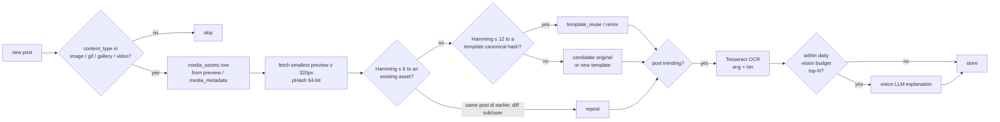

# Meme Intelligence

Memes are first-class content: they get their own pipeline, tables (`media_assets`, `meme_templates`, `meme_analyses`) and UI page.

## Copyright and media handling (hard rules, ADR-006)

- **No binary media is stored.** Preview images are fetched transiently into memory from Reddit's own preview URLs, hashed/OCR'd, then discarded.
- The UI shows media by linking/embedding Reddit's URL with a permalink. There is no rehosting.
- Generated output is **text** (captions, concepts, template names). No image generation in MVP. If added later, it will only produce original images, never reproductions of copyrighted templates' source art.
- Existing memes are **never presented as original**. Every generated concept that uses a known template says so.

## Pipeline



### Content typing (`content_type`)
Derived from `post_hint`, `is_gallery`, `is_video`, `domain` (`i.redd.it`, `v.redd.it`, `i.imgur.com`, `youtube.com`…) and URL extension. `.gif` / `preview.reddit_video_preview` → `gif`. A title ending in `?` with no media → `question`. A domain on the news list (config) → `news`.

### Video and GIF
Only metadata (duration, dimensions, thumbnail) plus pHash of the **thumbnail/preview frame**. No video download or frame extraction in MVP (cost + copyright). Frame sampling is L, opt-in.

### Template clustering
- Templates are defined by pHash similarity **after masking text regions** found by OCR bounding boxes. Different captions on the same base image then still match.
- New template: ≥ 3 assets within Hamming 12 of each other across ≥ 2 posts, none matching an existing template. The canonical hash is the medoid.
- Template names: the vision LLM is asked for a name only when a template is first created (cheap, once).

### Originality labels
| Label | Rule |
|---|---|
| `repost` | Hamming ≤ 6 to an earlier asset **and** OCR text similarity ≥ 0.9 |
| `template_reuse` | matches a template, new caption |
| `remix` | matches a template, plus extra visual elements (Hamming 7–12 after masking) or different caption structure |
| `original` | no match anywhere in our index — labelled "no match found in collected data", **not** "verified original" |
| `unknown` | no preview available |

### Vision-LLM analysis (top-N per day, default 20)
Structured output schema:
```json
{"scene": "what is happening in the image",
 "joke": "the punchline / why it is funny",
 "cultural_reference": "e.g. Bollywood film X, IPL, Silicon Valley layoffs",
 "audience": "who gets the joke",
 "format_markers": "what makes the format recognisable",
 "humour_category": "situational | reaction | absurdist | wordplay | relatable | satire | dark | wholesome",
 "region": "IN | GLOBAL | both",
 "community_specific": true,
 "confidence": 0.0}
```
Inputs: preview image + OCR text + title + subreddit + template name (if any). These are all model interpretations and are labelled as such in the UI.

## Template lifecycle (L)
Per template: first seen, posts per day, subreddit spread, peak date, status (`new`, `spreading`, `saturated`, `fading`). This reuses the topic status rules from [TREND_DETECTION.md](TREND_DETECTION.md) applied to template post counts.

## Meme concept generation
Inputs: a trending topic or template + target subreddit profile + rules. Output per concept:
- template recommendation (existing named template, **marked as such**) or "original concept"
- image description (what to draw/photograph/screenshot)
- 3–5 caption / punchline variants
- cultural context and who it lands with
- suggested subreddits + rule check (e.g. r/india may restrict memes to certain days/flairs; this is enforced from parsed rules)
- risks (sensitivity, overused template, repost risk)

## Costs
pHash and Tesseract are local and free. The only paid step is vision explanation, capped per day. Expected: 20 images/day at the vision tier.
