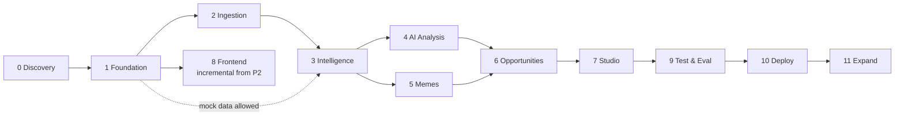

# Phased Implementation Plan

Rule: a dependent phase does not start until the previous phase's acceptance criteria are met, unless a decision in [DECISIONS.md](DECISIONS.md) justifies it. Each phase ends with: tests green, lint/types clean, docs + [IMPLEMENTATION_STATUS.md](IMPLEMENTATION_STATUS.md) + [CHANGELOG.md](CHANGELOG.md) updated, commit + push.

Complexity: S (≤ 1 day) · M (2–4 days) · L (1–2 weeks) · XL (> 2 weeks), for one developer.

---

## Phase 0 — Discovery & feasibility · S–M (mostly waiting on Reddit)
**Objectives**: prove we can legally and technically get the data; lock MVP scope.
**Tasks**
1. Apply for Reddit API access (neutral app name, personal non-commercial use, read + optional submit). *(Manual, user)*
2. Re-verify every ⚠️ item in [REDDIT_API.md](REDDIT_API.md) against current Reddit docs/terms; record results.
3. Once credentials exist: `scripts/smoke_reddit.py` → auth, 1 listing, 1 `/api/info`, 1 rules call, print rate-limit headers.
4. Check the field availability table on ~10 real posts of each content type (image, gallery, video, poll, link).
5. Pick the embedding model: embed 50 Hinglish + 50 English titles with both candidates and eyeball nearest neighbours (ADR-003).
6. Create a Groq API key (free, no card) and re-verify the free-tier limits and model IDs.
7. Write the seed subreddit list (general IN + GLOBAL subs, including r/vit and politics subs; no NSFW).
**Dependencies**: Reddit approval (external), Groq API key.
**Expected files**: `scripts/smoke_reddit.py`, `config/subreddits.seed.yaml`, updates to `REDDIT_API.md`, `DECISIONS.md`.
**Acceptance**: smoke script succeeds against real Reddit **or** a documented decision to proceed on mock data while approval is pending; all ⚠️ items resolved or explicitly accepted as risks.
**Testing**: manual smoke run, output pasted into DECISIONS.
**DoD**: assumptions table updated; MVP scope confirmed by user.
**Risks**: API access denied/slow (→ mock path); terms forbid embeddings (→ would require redesign, flag immediately).

## Phase 1 — Project foundation · M
**Objectives**: a reproducible skeleton that runs end-to-end with nothing in it.
**Features**: backend app factory, settings, logging, DB session, Alembic with extensions, health endpoints; Next.js app with theme, layout shell, nav, empty pages; compose stack; CI.
**Tasks**: `.gitignore`, `.env.example`, `backend/pyproject.toml` (uv, ruff, mypy, pytest), `frontend/` (Next.js, TS strict, Tailwind, shadcn/ui init, Vitest, Playwright), Dockerfiles, `docker-compose.yml`, first Alembic migration (extensions + `users`), session auth + admin bootstrap, GitHub Actions workflow, `openapi-typescript` generation script.
**Dependencies**: none (Phase 0 can run in parallel while waiting for Reddit).
**Expected files**: `backend/app/{main.py,core/*,api/v1/health.py,api/v1/auth.py}`, `backend/alembic/*`, `backend/tests/*`, `frontend/app/*`, `frontend/components/ui/*`, `docker-compose.yml`, `.github/workflows/ci.yml`.
**Acceptance**: `docker compose up` → `/health/ready` 200; frontend shows the shell at :3000 with login; CI green on push.
**Testing**: health route tests, settings test, auth tests, one Vitest, one Playwright smoke.
**DoD**: README quickstart works from a clean clone.
**Risks**: dependency version churn (pin + lockfiles).

## Phase 2 — Reddit ingestion · L
**Objectives**: reliable, compliant, incremental collection.
**Features**: ING-01…ING-12.
**Tasks**: `RedditClient` (PRAW wrapper + QPM limiter + header backoff), normalisers + content typing, subreddit CRUD API, `posts`/`post_snapshots`/`comments`/`subreddits`/`subreddit_rules`/`media_assets` migrations, `collect_cycle`, `subreddit_refresh`, `retention` Celery tasks, mock seed loader (`source="mock"`), Settings + Subreddit pages (frontend).
**Dependencies**: P1; real credentials for acceptance.
**Acceptance**: 24 h unattended run against real Reddit on the seed list: 0 duplicate posts, 0 429s that weren't retried, every cycle logged, snapshots present for tracked posts, deleted-post purge verified on at least one case.
**Testing**: unit (normalisers, typing, limiter), integration (upsert idempotency, retention), fixture-based client tests.
**DoD**: Agent Monitor can show collection runs (minimal page OK).
**Risks**: field inconsistency across post types; PRAW limitations.

## Phase 3 — Data intelligence · L
**Features**: CLS-01…04, TRD-01…06 (report without LLM text).
**Tasks**: taxonomy YAML + loader, embedding service + cache, keyword/embedding classifier, clustering (assign + HDBSCAN discover), metrics + scoring with `score_breakdown`, `trend_snapshots`, status rules, IN vs global aggregates, `/topics` + `/categories` APIs, Trend Explorer + Dashboard (topic widgets).
**Dependencies**: P2 (≥ 3 days of real data to tune thresholds; mock allowed for code).
**Acceptance**: on real data, top-20 topics hand-reviewed as "sensible" ≥ 15/20; every score shows its breakdown; classification P/R ≥ 0.7 on the golden set.
**Testing**: unit tests for every metric/score formula; clustering determinism test with fixed seed; golden-set eval.
**Risks**: Hinglish embedding quality; threshold tuning time.

## Phase 4 — AI analysis · M
**Features**: OPN-01…04, SUB-01…03, topic labels/summaries, LLM client + budget + usage tracking, `daily_report` graph.
**Dependencies**: P3; LLM key.
**Acceptance**: daily report generated automatically 3 days in a row within budget; 100% of opinions have valid evidence IDs; observed vs interpretation shown.
**Testing**: FakeLLM graph tests (incl. budget deferral), evidence-validity checker, opinion eval.
**Risks**: LLM cost drift → caps; hallucinated evidence → validator rejects.

## Phase 5 — Meme & multimodal · M–L
**Features**: MEM-01…05, MEM-08 (concept gen moves to P7 tooling but schema defined here).
**Tasks**: media typing, transient fetch with SSRF guard, pHash, text-masked template matching, Tesseract (eng+hin) in the image, originality labels, vision explanations top-N, Meme Intelligence page.
**Dependencies**: P2 (media metadata), P4 (LLM client).
**Acceptance**: on 200 real meme posts: repost detection precision ≥ 0.9 on a hand-checked sample; template clusters hand-reviewed sensible; vision calls ≤ daily cap.
**Risks**: OCR quality on stylised fonts; preview URL expiry.

## Phase 6 — Opportunity engine · M
**Features**: OPP-01…03 (MVP types), opportunity scoring + breakdown, rationale text, Content Opportunities page.
**Dependencies**: P3, P4 (P5 for meme opportunities).
**Acceptance**: ≥ 10 opportunities/day across ≥ 5 subreddits; every one has sources + risks + confidence; user rates ≥ 40% useful over a week.
**Risks**: generic suggestions → tighten gap/sub_fit signals.

## Phase 7 — AI content studio · L
**Features**: GEN-01…04, CRT-01…03, APR-01…03, ANA-01…02, meme concepts.
**Tasks**: `generate_drafts` graph with interrupt, critic (deterministic + LLM), draft versioning, approval API + audit log, placeholder enforcement, Studio + Draft Manager pages, link-post flow, contribution tracking job.
**Dependencies**: P6.
**Acceptance**: end-to-end: opportunity → 3 variants → critic → edit → approve → copy → link posted URL → metrics tracked. Critic catches ≥ 90% of seeded violations. Fail/placeholder drafts cannot be approved (API test).
**Risks**: critic false positives annoying the user → warn vs fail tuning.

## Phase 8 — Frontend integration · L (incremental from P2)
**Features**: all MVP pages polished: loading/empty/error/pagination states, charts, responsive layouts, dark theme.
**Acceptance**: every page backed by a real endpoint, no dead buttons; Lighthouse a11y ≥ 90; Playwright covers the main flow.
**Risks**: scope creep in visuals.

## Phase 9 — Testing & evaluation · M
**Tasks**: coverage gaps, performance seed + checks, security checks (gitleaks, audits, auth tests, SSRF tests), eval runs recorded.
**Acceptance**: targets in [TESTING_STRATEGY.md](TESTING_STRATEGY.md) met; results recorded in IMPLEMENTATION_STATUS.

## Phase 10 — Deployment · M
**Tasks**: choose target (open question), prod compose/override or PaaS config, TLS, secrets, migrations job, backups, uptime monitoring, DEPLOYMENT.md finalised.
**Acceptance**: prod running 7 days; daily report produced daily; restore-from-backup tested once.

## Phase 11 — Optimisation & expansion · ongoing
Seasonal/unexpected trends (TRD-07), meme lifecycle (MEM-06), visual embeddings (MEM-07), discussion-quality analytics (ANA-03), feedback-learned weights (ANA-04), API publishing (APR-04), more categories, cost tuning, more formats (image/video concepts).
