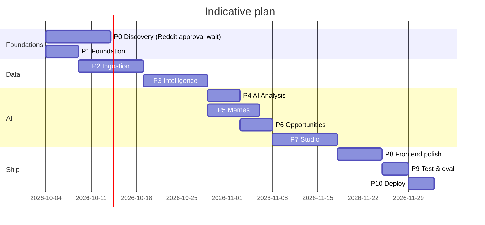

# Roadmap

## MVP (Phases 0–8, plus the essential parts of 9)

**In scope**
- Real Reddit ingestion for ~40 subreddits (IN + GLOBAL), snapshots, rules, retention
- Taxonomy-based multi-label classification, topic clustering, explainable trend scores, statuses
- Daily trend report (IN vs global, diffs)
- Opinion mining with evidence on demand + top topics daily
- Meme pipeline: typing, pHash, templates, originality labels, OCR, vision explanations (capped)
- Opportunities (8 types), studio (text, question, opinion, comment, poll, meme concept), critic, approval, audit
- Manual "copy → post on Reddit → link URL" flow + basic contribution metrics
- Dashboard + 9 MVP pages, Agent Monitor with cost tracking
- Docker compose, CI, tests

**Out of MVP (later)**
- API publishing (APR-04)
- Analytics page with discussion-quality metrics and feedback-learned weights
- Seasonal / unexpected trend detection (needs history)
- Visual embeddings, meme lifecycle charts, video frame analysis
- Image/infographic/video concept formats
- Multi-user, dedicated Indian/Global pages
- Production deployment hardening beyond a single environment

## Timeline (indicative, one developer, part-time)

## Open questions (need user input)
1. Reddit API: do you already have an approved app / credentials? If not, OK to apply now with a neutral app name?
2. LLM: Anthropic as the default provider OK? Daily budget, $1 default?
3. Separate read-only Reddit account for collection (recommended) vs. your main account?
4. Seed subreddits: any must-haves beyond the defaults (r/india, r/indiasocial, r/IndianDankMemes, r/developersIndia, r/IndiaInvestments, r/bangalore, r/mumbai, r/delhi, r/Cricket, r/bollywood … / r/technology, r/programming, r/ProgrammerHumor, r/memes, r/personalfinance, r/movies, r/gaming, r/AskReddit, r/worldnews, r/MachineLearning …)?
5. NSFW excluded entirely: OK?
6. Politics: include Indian politics subs (high-risk, sensitive) in MVP or defer?
7. Production target (VPS vs PaaS): decide at Phase 10.
