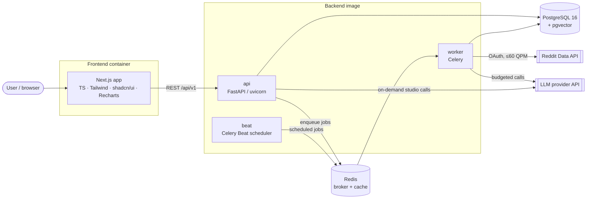
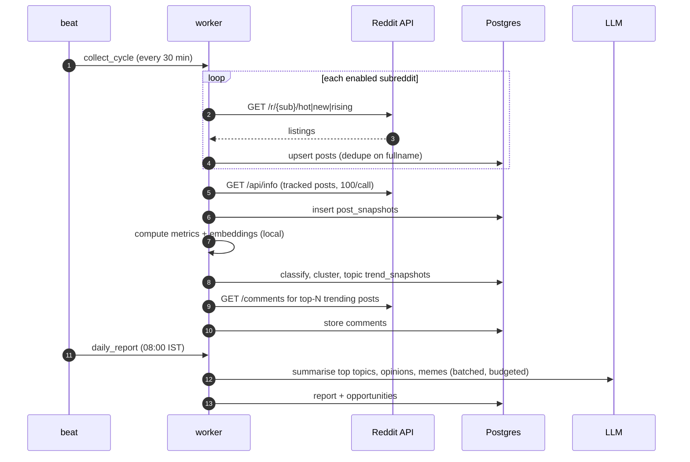

# System Architecture

## Style: modular monolith

One FastAPI backend codebase, deployed as **three processes from the same image** (`api`, `worker`, `beat`), plus a Next.js frontend. Modules talk to each other through in-process service calls, not HTTP. This is the smallest design that still lets ingestion, analysis and the API scale and fail independently (ADR-002).

## Container diagram



## Backend module layout

```
backend/
├── app/
│   ├── main.py               # FastAPI app factory, router mounting
│   ├── api/v1/               # thin routers: validation → service call → schema
│   ├── core/                 # settings (pydantic-settings), logging, db session, errors, security
│   ├── models/               # SQLAlchemy ORM models
│   ├── schemas/              # Pydantic request/response + LLM structured-output schemas
│   ├── repositories/         # DB queries only (no business logic)
│   ├── services/             # business logic used by API and workers
│   ├── ingestion/            # Reddit client, rate limiter, normalisers, collectors
│   ├── intelligence/         # taxonomy, classification, embeddings, clustering, trend scoring, opinions
│   ├── meme_analysis/        # media typing, pHash, OCR, template clustering
│   ├── agents/               # LangGraph graphs, nodes, LLM client, budget/usage tracking
│   ├── analytics/            # contribution tracking, performance metrics
│   └── workers/              # Celery app, task definitions, beat schedule
├── alembic/                  # migrations
├── config/taxonomy.yaml      # category tree (data, not code)
└── tests/
```

Dependency rule: `api → services → (repositories | intelligence | ingestion | agents …) → models`. Routers never touch the ORM directly. `intelligence` and `meme_analysis` functions are pure where possible (data in, result out), which keeps them unit-testable without a DB.

## Main data flow



## Job types (selective execution)

Each job runs only the modules it needs. Graph details are in [AI_AGENT_DESIGN.md](AI_AGENT_DESIGN.md).

| Job | Trigger | Steps |
|---|---|---|
| `collect_cycle` | beat, 30 min | ingest → snapshot → metrics → embed → classify → cluster → trend scores (no LLM) |
| `subreddit_refresh` | beat, daily | about + rules + post requirements → profile recompute |
| `meme_cycle` | after collect_cycle | media posts → pHash → template match → OCR for trending only |
| `daily_report` | beat, daily | top topics → LLM summaries + opinions (top-K) + meme explanations (top-N) → opportunities |
| `analyze_topic` / `analyze_subreddit` / `analyze_meme` | user, on demand | only the relevant nodes |
| `generate_drafts` | user | opportunity → generate variants → critic → interrupt for approval |
| `retention` | beat, daily | purge expired and deleted content |
| `track_contributions` | beat, hourly | refresh metrics for linked user posts |

## Configuration

- `pydantic-settings` reads env vars (`.env` locally). One `Settings` object, injected.
- Per-task model selection: `LLM_MODEL_CHEAP`, `LLM_MODEL_STRONG`, `LLM_MODEL_VISION`.
- Budgets: `LLM_DAILY_BUDGET_USD`, `VISION_DAILY_LIMIT`, `COMMENTS_TOP_N`.
- Taxonomy and scoring weights live in versioned files (`config/taxonomy.yaml`, `config/scoring.yaml`), loaded into the DB with a version stamp so every score references the weights that produced it.

## Logging & observability

- `structlog` JSON logs to stdout with `request_id`, `job_id`, `run_id`, `subreddit`.
- `agent_runs` + `agent_run_steps` tables hold the per-node timeline, tokens and cost, which the Agent Monitor UI reads.
- Health endpoints: `/health` (liveness), `/health/ready` (DB + Redis), `/health/reddit` (last successful call, rate-limit remaining).

## Frontend

- Next.js (App Router) + TypeScript strict + Tailwind + shadcn/ui + Recharts.
- Data fetching: server components for initial loads, plus TanStack Query in client components for filters/pagination. TanStack Query is the only extra dependency we deliberately accept.
- API types generated from FastAPI's OpenAPI schema (`openapi-typescript`), so there are no hand-written duplicate types.
- Theme: dark-first, near-black `#0B0D0C` / charcoal `#151917` surfaces, single green accent (`#3DDC84` family), Inter/Geist type, dense but calm cards. No gradients-everywhere "AI dashboard" look.
- Every page implements loading (skeleton), empty, error and paginated states. No buttons without a working backend action.

| Page | MVP | Backed by |
|---|---|---|
| Dashboard | ✅ | `/dashboard/summary` |
| Daily Trends | ✅ | `/reports/daily/{date}` |
| Trend Explorer (+ IN/Global filter) | ✅ | `/topics`, `/topics/{id}` |
| Indian Reddit / Global Reddit | Filter presets of Trend Explorer in MVP | same |
| Meme Intelligence | ✅ | `/memes/templates`, `/memes/posts` |
| Opinion Explorer | ✅ | `/topics/{id}/opinions` |
| Subreddit Explorer | ✅ | `/subreddits` |
| Content Opportunities | ✅ | `/opportunities` |
| AI Content Studio + Draft Manager | ✅ | `/drafts` |
| Analytics | L | `/analytics/*` |
| Agent Execution Monitor | ✅ | `/agent-runs` |
| Settings | ✅ | `/settings`, `/subreddits` CRUD |

## Deployment shape

Frontend and backend deploy independently (separate Dockerfiles). See [DEPLOYMENT.md](DEPLOYMENT.md).
