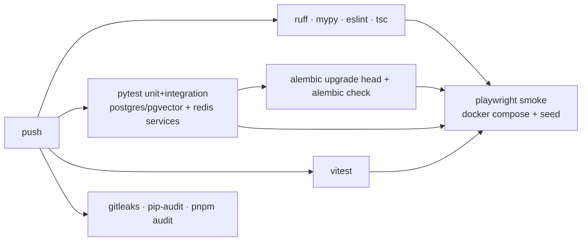

# Testing Strategy

## Layers

| Layer | Tool | Scope | Runs |
|---|---|---|---|
| Unit | pytest | pure functions: metrics, scoring, normalisers, content typing, pHash matching, rule parsers, critic deterministic checks | every PR |
| Integration | pytest + real Postgres (pgvector) + Redis via docker compose / CI services | repositories, migrations, Celery tasks (eager mode), API routes via `httpx.AsyncClient` | every PR |
| Reddit client | pytest + **recorded fixtures** (JSON files of real API response *shapes*, with text replaced by synthetic text, labelled `fixtures/reddit/*.json`) + `respx` | rate limiter, pagination, retries, normalisation | every PR |
| Agent graphs | pytest + `FakeLLM` | node wiring, state transitions, budget deferral, interrupt/resume, retry paths | every PR |
| LLM evals | pytest `-m eval` with the real model | classification P/R, critic recall, opinion evidence validity | manual / nightly, budget-capped |
| Frontend unit | Vitest + Testing Library | components, formatters, state hooks | every PR |
| E2E | Playwright against compose stack with **mock data seed** | login → dashboard → topic → opportunity → generate (FakeLLM) → approve | every PR (smoke), full nightly |
| Live smoke | script `scripts/smoke_reddit.py` | real Reddit auth + 1 listing call | manual, Phase 2 acceptance |

## Rules

- **No network in PR tests.** Reddit and LLM calls are faked; anything that slips through fails the test (`respx` strict mode, socket guard).
- **Never skip failing tests silently.** `xfail` requires a linked issue and a reason string; CI reports the count.
- Mock fixtures carry `source="mock"`; tests assert that mock data can never be written with `source="reddit"`.
- Coverage target: 80% lines for `intelligence/`, `ingestion/`, `services/`; no target for glue code.
- Each bug fix adds one regression test.

## CI (GitHub Actions)

## Performance checks (Phase 9)
- Seed 100k posts / 2k topics synthetic; assert dashboard endpoints p95 < 500 ms (`pytest-benchmark` or `locust` script).
- Ingestion cycle for 40 subs (with fixture responses) < 5 min wall clock.
